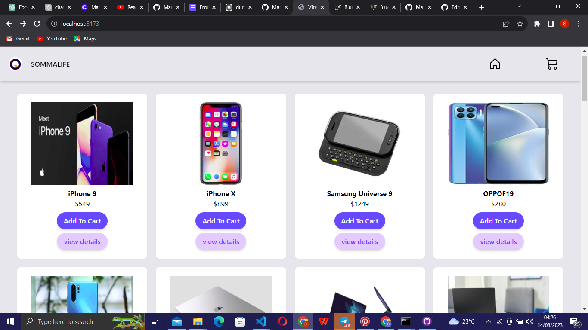
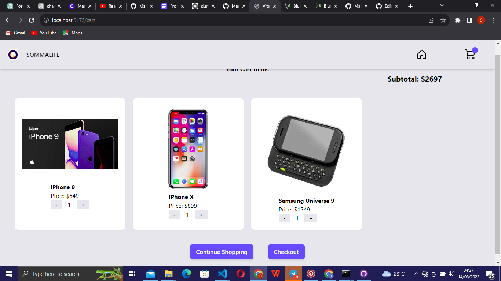

# Simple E-commerce web app

Welcome to the **Simple e-commmerce web app** repository! This project is an implementation of a simple e-commerce website with the following features:

- List Products Page: Displays a list of products, showing their name, price, and a "View Details" button. Clicking the button navigates to the Product Details page.

- Product Details Page: Shows detailed information about a selected product, including its name, price, description, and an "Add to Cart" button.

- Checkout Page: Allows users to enter their phone number for checkout. Displays a summary of the products being purchased.

- Checkout Success Page: After successful checkout, users are redirected to this page with a confirmation message.

## Table of Contents

- [Installation](#installation)
- [Usage](#usage)
- [Screenshots](#screenshots)
- [Technologies Used](#technologies-used)
- [Contributing](#contributing)
- [License](#license)

## Installation

1. Clone the repository:

   ```bash
   git clone https://github.com/your-username/project-name.git
   ```

2. Navigate to the project directory:

   ```bash
   cd project-name
   ```

3. Install dependencies:

   ```bash
   npm install
   ```

## Usage

1. Run the development server:

   ```bash
   npm start
   ```

2. Open your web browser and navigate to `http://localhost:3000`.

## Screenshots


_List Products Page_


_Product Details Page_


_Checkout Page_


_Checkout Success Page_


_Cart-items Page_

## Technologies Used

- React
- React Router
- Phosphor-react 
- TailwindCSS
  

## Contributing

Contributions are welcome! If you have suggestions, bug reports, or want to contribute code, please follow these steps:

1. Fork the repository.
2. Create a new branch: `git checkout -b feature-name`.
3. Make changes and commit: `git commit -m "Add feature"`.
4. Push to the branch: `git push origin feature-name`.
5. Create a pull request.

## License

This project is licensed under the [MIT License](LICENSE).

---
